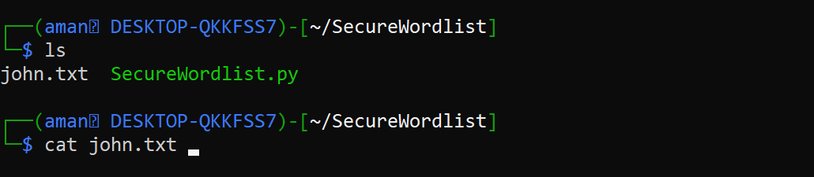
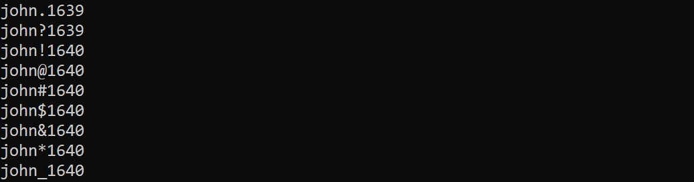
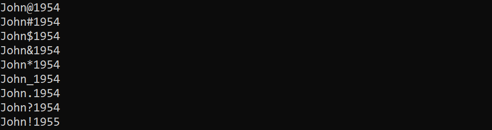
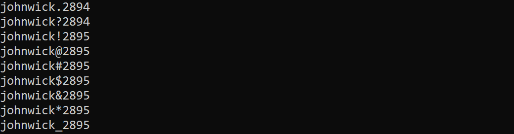
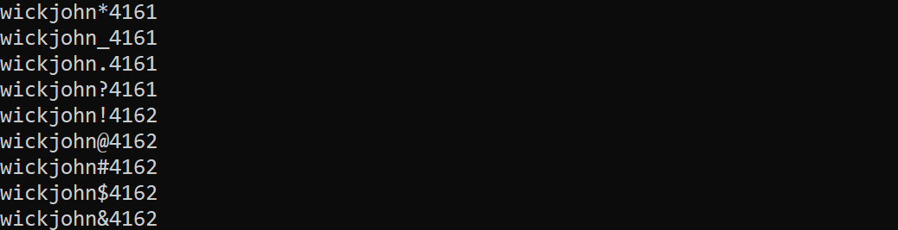

# SecureWordlist

SecureWordlist is a Python-based tool designed to generate common alphanumeric passwords that people often use in their daily lives. This tool can be used to enhance the security of organizations by brute-forcing security systems to identify weak passwords.

## Features

- **Three Distinct Modes**:
  - **Casual Mode**: Generates basic combinations.
  - **Pro Mode**: Generates more advanced combinations.
  - **Beast Mode**: Generates highly complex combinations.

## Installation

1. Clone the repository:

    ```sh
    git clone https://github.com/AmanChauhan/SecureWordlist.git
    ```

2. Navigate to the project directory:

    ```sh
    cd SecureWordlist
    ```

## Usage

Run the script using Python:

```sh
python3 SecureWordlist.py
```

Follow the on-screen instructions to choose the mode and provide the necessary details:

1. Choose the mode (1 for Casual, 2 for Pro, or 3 for Beast).
2. Enter the first name of the target.
3. Enter the last name of the target (optional).
4. Enter the filename to save the generated wordlist.

```sh
Choose the mode (1, 2, or 3): 3
Enter the first name of target: John
Enter the last name of target (optional): Wick
Enter the filename to save the wordlist (no spaces allowed): wordlist.txt
```
After running the above commands, the generated wordlist will be saved in the specified file

## Screenshots










## Author
Aman Chauhan
